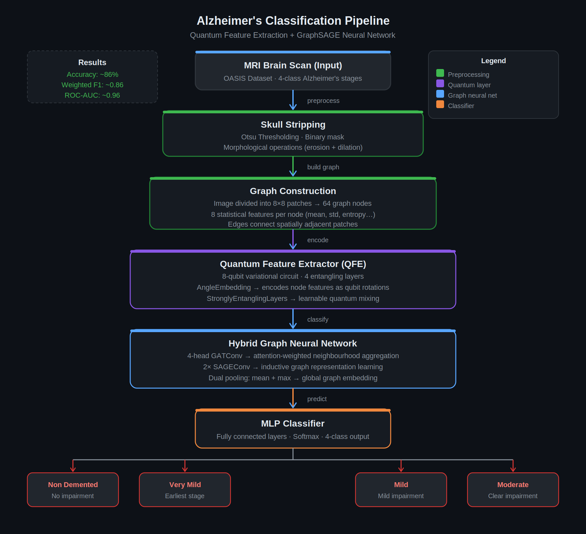

# Alzheimer's Disease Classification Using Quantum Feature Extraction with GraphSAGE

<p align="center">
  
</p>

<p align="center">
  
  
  
  
  
</p>

---


---

## Overview

This project builds a hybrid quantum-classical deep learning pipeline that classifies brain MRI scans into four Alzheimer's disease stages. MRI images go through skull stripping, get converted into patch-based graphs, pass through an 8-qubit quantum variational circuit, and are then classified by a graph neural network.

The pipeline achieves **~86% accuracy** and **~0.96 ROC-AUC** on the 4-class task.

---

## Pipeline Architecture

The full pipeline has six stages:

```
MRI Brain Scan
      ↓
Skull Stripping           ← Otsu thresholding + morphological ops
      ↓
Graph Construction        ← 8×8 patches → 64 nodes, 8 features/node
      ↓
Quantum Feature Extractor ← 8-qubit PennyLane circuit, 4 layers
      ↓
Hybrid GNN                ← 4-head GATConv → 2× SAGEConv → mean+max pool
      ↓
MLP Classifier            ← Softmax → 4-class output
```

---

## Stage-by-Stage Explanation

### 1. MRI Brain Scan (Input)

Raw T1-weighted MRI scans from the OASIS dataset. Four Alzheimer's disease stages are targeted:

| Class | Description |
|---|---|
| NonDemented | No cognitive impairment |
| VeryMildDemented | Earliest observable stage |
| MildDemented | Mild cognitive impairment |
| ModerateDemented | Clear, measurable impairment |

The ModerateDemented class is severely underrepresented in the raw dataset. This is handled during training via weighted random sampling.

---

### 2. Skull Stripping

The skull and non-brain tissue are removed from each MRI before any learning happens. This prevents the model from picking up on irrelevant anatomical features outside the brain.

**How it works:**
- **Otsu thresholding** — automatically finds the optimal pixel intensity cutoff to separate brain from background
- **Morphological operations** — erosion removes noise, dilation restores brain boundaries, connected component analysis isolates the largest brain region
- Output is a clean brain mask applied to the original scan

---

### 3. Graph Construction

Instead of treating the MRI as a flat image, we model it as a graph. This lets the GNN capture spatial relationships between brain regions.

**How it works:**
- The skull-stripped MRI is divided into **8×8 non-overlapping patches** → 64 patches total
- Each patch becomes a **graph node**
- Each node carries **8 statistical features**: mean intensity, standard deviation, entropy, skewness, kurtosis, contrast, energy, homogeneity
- **Edges** connect spatially adjacent patches

Result: every MRI becomes a graph with 64 nodes × 8 features.

---

### 4. Quantum Feature Extractor (QFE)

A variational quantum circuit processes the node features before the GNN sees them. It acts as a learnable feature preprocessor — the quantum parameters are optimized during backpropagation alongside the classical layers.

**Circuit design (PennyLane):**
- **8 qubits** — one per node feature dimension
- **AngleEmbedding** — encodes the 8 node features as rotation angles on the qubits (Rx gates)
- **StronglyEntanglingLayers** — 4 layers of parameterized single-qubit rotations + CNOT entanglement gates
- **Measurement** — Pauli-Z expectation values on all 8 qubits → 8-dimensional quantum output vector

The quantum layer introduces non-linear transformations in the Hilbert space that classical linear layers cannot directly replicate. In this architecture, the GATConv and SAGEConv layers handle most of the classification; the QFE contributes as a differentiable preprocessing block within the hybrid pipeline.

---

### 5. Hybrid Graph Neural Network

After quantum preprocessing, the transformed node features pass through a two-stage GNN.

**Stage A — GATConv (Graph Attention Network Convolution):**
- 4 attention heads run in parallel
- Each head learns a different attention weighting over the neighbourhood
- Outputs are concatenated → richer node representations
- Attention mechanism lets the model focus on the most relevant neighbouring patches

**Stage B — SAGEConv (GraphSAGE Convolution):**
- 2 SAGEConv layers aggregate neighbourhood information inductively
- Each node samples and aggregates features from its local subgraph
- Works well on graphs with varying structure, unlike spectral methods

**Pooling:**
- **Mean pooling** — captures the average graph-level signal
- **Max pooling** — captures the most prominent features across the graph
- Both vectors are concatenated → final graph embedding

---

### 6. MLP Classifier

The graph embedding is passed to a fully connected MLP:
- Linear → BatchNorm → ReLU → Dropout → Linear → Softmax
- Output: 4-class probability distribution
- Predicted class = argmax of softmax output

---

## Results

| Metric | Score |
|---|---|
| 4-class Accuracy | ~86% |
| Weighted F1-Score | ~0.86 |
| ROC-AUC | ~0.96 |

Training prints loss and accuracy every 10 epochs. Class imbalance is handled via `WeightedRandomSampler` so the minority class (ModerateDemented) gets adequate representation.

---

## Tech Stack

| Component | Tool / Library |
|---|---|
| Quantum circuit | PennyLane |
| Graph neural network | PyTorch Geometric (GATConv, SAGEConv) |
| Deep learning | PyTorch |
| MRI preprocessing | OpenCV, NumPy, scikit-image |
| Training environment | Google Colab (T4 GPU) |
| Visualization | Matplotlib, seaborn |

---

## How to Run

1. Open `Alzheimer_SkullStrip.ipynb` in [Google Colab](https://colab.research.google.com)
2. Mount Google Drive:
   ```python
   from google.colab import drive
   drive.mount('/content/drive')
   ```
3. Set the dataset path to your OASIS folder
4. Install dependencies (first cell handles this):
   ```bash
   pip install pennylane torch-geometric
   ```
5. Run all cells top to bottom — preprocessing → graph construction → training → evaluation
6. Training logs every 10 epochs. Full run takes **30–60 minutes** on a Colab T4 GPU.

---

## File Structure

```
├── Alzheimer_SkullStrip.ipynb    # Full pipeline — preprocessing to evaluation
├── architecture.png              # Pipeline architecture diagram
└── README.md
```

---


---


---

## Note on the Quantum Component

The Quantum Feature Extractor uses an 8-qubit variational circuit trained end-to-end with the GNN via backpropagation. It functions as a trainable preprocessing block — not a standalone classifier. The GATConv and SAGEConv layers drive most of the classification performance.

This is an accurate characterization of where hybrid quantum-classical models are right now. The quantum component is a differentiable feature transformer integrated into a classical deep learning system. The goal was a working hybrid pipeline — and it works.
